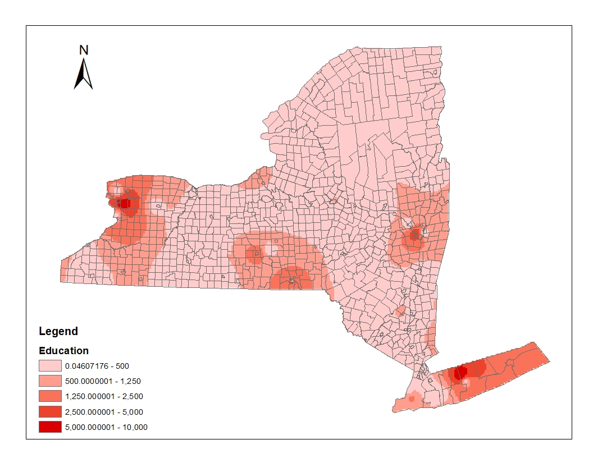
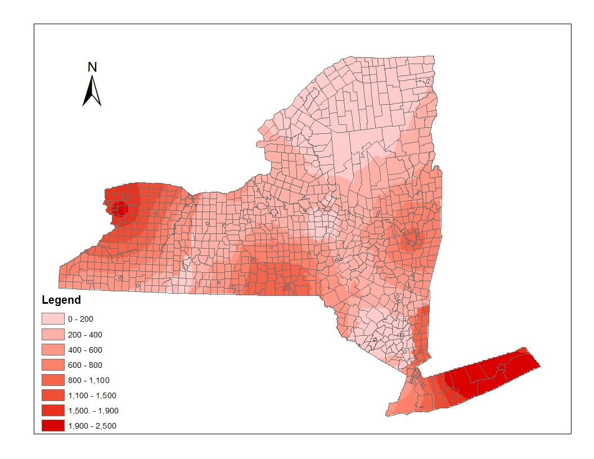

# Introduction

The accessibility of public education is always an important things for people. In New York state, there are 61 public universities or colleges for high education. However, when presenting them on the map, we found that in some areas, there a several clustered schools together, while in some other areas, the nearest university or college are too far away. This means that peopel living in some areas of New York state have an inaccessibity on high education. Lack of necessary will be a big social problem for local residents, and if the government have budget to build a new one, it will be important to cover those in need. Since it can be a p-median problem, we can use a package called tbart to solve such kind of location analysis problem.  
And here are two pictures by using IDW and Kriging, showing the public high educational level in the whole state.





From these two pictures, though there are some differences, we can find that at the north of the state, public university is lack. So if in the future, the state government want to build more community colleges, we have a rough guess about the potential sites to choose from.

# methods and Data preparation

## Methods

* Using Arcgis to do geocoding work with New York State locator
* Visualizing the distribution of population in New York State
* Visualizing the distribution of public universities and colleges in New York State
* Using kriging to build a map in order to see if there are some areas lack of influences by public education
* Solve it as p-median problem, finding when we add the number of new schools, where will be the best choice

## Data preparation
Load any required packages in a code chunk (you may need to install some packages):

```{r, message=F, warning=F}
library(maptools)
library(sf)
library(ggplot2)
library(dplyr)
library(tbart)
```

```{r, message=F, warning=F, results='hide'}
# load data
schools <- sf::st_read ('data/school.shp')
population <- sf::st_read ('data/Cities_Towns.shp')
```

```{r, message=F, warning=F, results='hide'} 
# data wrangling
schools=schools%>%mutate(total_students=Undergradu+Graduate_E)
sf_population=st_as_sf(population)
sf_schools=st_as_sf(schools)
```


# Results

```{r, message=F, warning=F, results='hide'}
#map of distribution of population
sf_population%>%ggplot()+
  geom_sf(aes(fill=-log2(POP2010)))+
  theme(legend.position = 'bottom')
```

```{r, message=F, warning=F, results='hide'}
#map of distribution of public universities and colleges
ggplot()+
  geom_sf(data=sf_population,aes(fill=-log2(POP2010)))+
  geom_sf(data=sf_schools,aes(colour='pink'))+
  theme(legend.position = 'bottom')
```

```{r, message=F, warning=F, results='hide'}
#change sf data to sp data
sp_population = as(population, "Spatial")
```

```{r, message=F, warning=F, results='hide'}
#find the towns/cities already covered
covered = c(10,18,38,47,56,76,95,100,105,124,129,173,205,208,235,246,249,301,329,399,401,436,439,447,500,531,532,553,581,594,602,622,641,656,707,720,722,734,735,749,787,793,821,822,841,863,864,881,897,925,953,956,989)
```

```{r, message=F, warning=F, results='hide'}
#solve p-median problem(take really long time)
dist <- matrix()
universities = matrix()
set.seed(12345)
for (i in 1:11){
  loc<- allocations(sp_population,p=i+52,force = covered)
  universities[i] = unique(loc$allocation)
  dist[i] <- sum(loc$allocdist) 
}
p <- c(0:10)
plot(p,dist)

delta_dist <- matrix()
for (j in 1:10){
delta_dist[j] = dist[j+1]-dist[j]
}
add <- c(1:10)
plot(add,delta_dist)
```

# Conclusions

From the previous charts, we can find that when add one more community college, the best location is Franklinville, but the total weighted distance decrease least. However, after that if we add one more again, the best location is West Turin, and this time the total weighted distance decrease a lot. 
It is quite different from our pervious assumption that both of these two towns are located in the south-west of New York State, it's obvious that the weight, population, plays a big role in our decision In p-median problem, we must put the weight in a significant place.
Though p-median problem is a classic model in location analysis, it has some limitations, and it can be only a reference in the real decision. When the government decides to build new public facilities, it's not only a geographic problem, but also a economic and social problem.

# References

The dataset of distribution of public universities and colleges. https://data.ny.gov/Education/City-University-of-New-York-CUNY-University-Campus/i5b5-imzn

The basement map of New York State which contains population data of each county. https://gis.ny.gov/gisdata/inventories/details.cfm?DSID=1278

